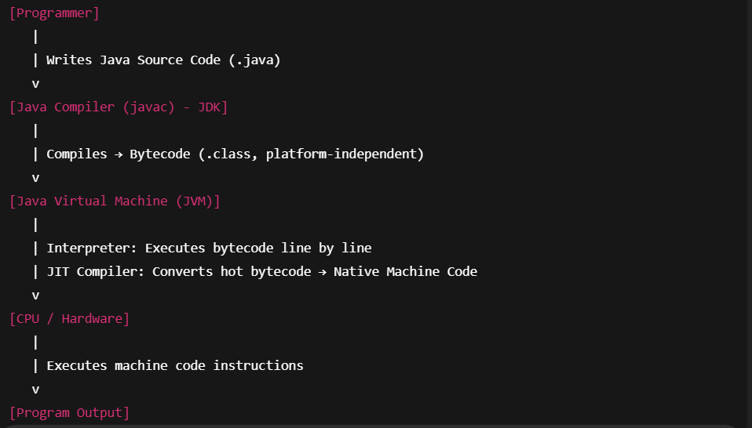

<h2><u>Introduction:</u></h2>

1. Java is just a programming language.

<h2><u>Java's Lineage:</u></h2>

1. Java's "Lineage" means the heritage and influences behind the Java programming language.
2. C → basic syntax (curly braces, loops, conditionals).
3. C++ → object-oriented structure (classes, methods).

<h2><u>The Birth of Modern Programming: C</u></h2>

1. C laid the foundation for today's programming.

<h2><u>C++: The Next Step</u></h2>

1. It extended C, by adding object oriented features

<h2><u>The Stage is set for Java:</u></h2>

1. The rise of the internet and the web created new requirements that lead directly to Java.

<h2><u>The creation of Java:</u></h2>

1. Java was developed at Sun Microsystems in 1991 by James Gosling and his team.
2. It was developed to solve portability problem

<h2><u>The	C#	Connection</u></h2>

1. C# is a Microsoft language for .NET that is heavily influenced by Java in syntax, design, and object-oriented concepts.

<h2><u>How	Java Impacted the Internet:</u></h2>

1. Java transformed the Internet by enabling secure, portable, and dynamic programs such as applets that could run on any platform.

<b> Note: </b> Applets are phased out now.

<h2><u>Java’s Magic: The Bytecode</u></h2>

1. Java compiler produces bytecode, not executable machine code.

2. Bytecode runs on the JVM, which is part of the Java Runtime Environment (JRE).

3. Platform independence is achieved because only the JVM is platform-specific.

4. JVM provides security by running programs in a restricted sandbox environment.

5. Java uses Just-In-Time (JIT) compilation to convert frequently used bytecode into native code for better performance.

6. Platform independent: Java byte code(.class file)

7. Platform dependent: JVM, JRE, JDK

8. Java is compiled to bytecode (compile-time) and interpreted by the JVM (run-time), making it both compiled and interpreted.

9. Java follows 2 step compilation: 

    Step 1: Source code is compiled into bytecode (platform independent).

    Step 2: Bytecode is executed by JVM, which converts it into machine code.

    JVM ensures security, portability, and memory management.
    
    Java Source Code (.java) -> Bytecode (.class) -> Native Machine Code -> Program Output

<h2><u>Moving Beyond Applets</u></h2>

1. Java applets and Web Start were removed due to lack of browser support and security issues; modern Java uses tools like jlink to create self-contained runtime images.

<h2><u>A Faster Release Schedule:</u></h2>

1. Feature Release (every 6 months)

<h2><u>Servlets: Java on the Server-side:</u></h2>

1. A servlet is a server-side Java program used to generate dynamic web content.

2. Servlets are JVM-based server-side Java programs.

<h2><u>The Java Buzzwords</u></h2>

| Feature               | Description |
|----------------------|-------------|
| Simple               | Java has a concise and cohesive set of features that makes it easy to learn and use. |
| Secure               | Java provides a secure means of creating Internet applications. |
| Portable             | Java programs can execute in any environment for which there is a Java runtime system. |
| Object-oriented      | Java embodies the modern object-oriented programming philosophy. |
| Robust               | Java encourages error-free programming by being strictly typed and performing run-time checks. |
| Multithreaded        | Java provides integrated support for multithreaded programming. |
| Architecture-neutral | Java is not tied to a specific machine or operating system architecture. |
| Interpreted          | Java supports cross-platform code through the use of Java bytecode. |
| High performance     | The Java bytecode is highly optimized for speed of execution. |
| Distributed          | Java was designed with the distributed environment of the Internet in mind. |
| Dynamic              | Java programs carry run-time type information used to verify and resolve access to objects at run time. |

<h2><u>The Evolution of	Java</u></h2>

-> Java 5, 8, and 9 are the most revolutionary releases

-> Java 8 → Lambdas & Streams

-> Java 9 → Modules

-> Java 11 → LTS, removal of legacy technologies

-> Java balances innovation + backward compatibility